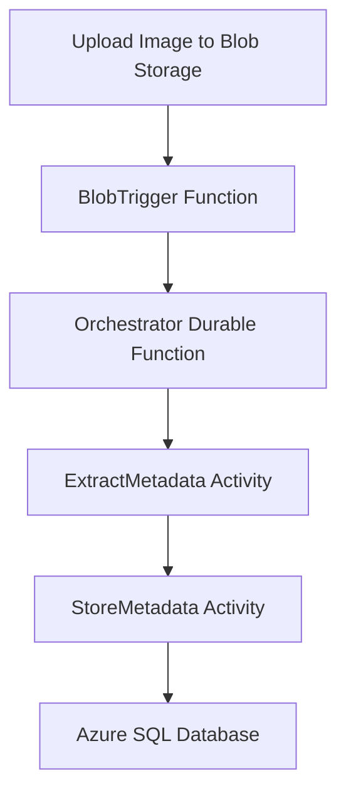

# Durable Image Metadata Processing Pipeline

## 📚 CST8917 Assignment 1 — Durable Workflow for Image Metadata Processing

This project demonstrates a complete serverless pipeline using Azure Durable Functions in Python. It processes user-uploaded images in real-time by extracting metadata and storing it in Azure SQL Database.

---

## 📦 Features

- ✅ Automatically triggers on image upload to Azure Blob Storage (`images-input`)
- ✅ Uses Durable Functions Orchestrator pattern
- ✅ Extracts metadata using Pillow
- ✅ Stores metadata in Azure SQL using `pyodbc`
- ✅ Written in Python and deployable to Azure Function App

---

## 🗂️ Folder Structure

```
durable-image-metadata-pipeline/
│
├── BlobTrigger/                     # Blob Trigger Function
│   ├── __init__.py
│   └── function.json
│
├── Orchestrator/                    # Orchestrator Durable Function
│   ├── __init__.py
│   └── function.json
│
├── ExtractMetadata/                # Activity Function - Metadata Extraction
│   ├── __init__.py
│   └── function.json
│
├── StoreMetadata/                  # Activity Function - Store in SQL
│   ├── __init__.py
│   └── function.json
│
├── venv/                           # Python virtual environment (not committed)
│
├── requirements.txt                # Python dependencies
├── local.settings.json             # Local config for Azure Functions (excluded from Git)
├── host.json                       # Azure Functions host configuration
├── .funcignore                     # Ignore files during publish
├── README.md                       # You're reading it :)
```

---

## 📷 Sample Workflow



---

## 🧪 Local Development Setup

### ✅ 1. Clone the Repo
```bash
git clone https://github.com/mspanwar21/durable-image-metadata-pipeline.git
cd durable-image-metadata-pipeline
```

### ✅ 2. Create a Virtual Environment
```bash
python3 -m venv venv
source venv/bin/activate
```

### ✅ 3. Install Dependencies
```bash
pip install --upgrade pip
pip install -r requirements.txt
```

### ✅ 4. Configure `local.settings.json`

Create a `local.settings.json` in the project root:

```json
{
  "IsEncrypted": false,
  "Values": {
    "AzureWebJobsStorage": "<your-storage-connection-string>",
    "FUNCTIONS_WORKER_RUNTIME": "python",
    "SQL_CONNECTION_STRING": "Driver={ODBC Driver 18 for SQL Server};Server=tcp:metadata-sqlsrv.database.windows.net;Database=ImageMetadataDB;Uid=sqladmin;Pwd=StrongPassword123!;Encrypt=yes;"
  }
}
```

---

## 🏗️ Azure SQL Setup

### ✅ Create the table

Run this in Azure SQL:

```sql
CREATE TABLE ImageMetadata (
    id INT PRIMARY KEY IDENTITY(1,1),
    name NVARCHAR(255),
    size_kb FLOAT,
    width INT,
    height INT,
    format NVARCHAR(50)
);
```

---

## ☁️ Deploy to Azure

### ✅ 1. Create Azure Resources

```bash
az group create --name metadata-rg --location eastus

az storage account create --name imagemetadatastg --resource-group metadata-rg --location eastus --sku Standard_LRS

az functionapp create --name imageMetadataFunctionApp \
  --resource-group metadata-rg \
  --storage-account imagemetadatastg \
  --consumption-plan-location eastus \
  --runtime python --functions-version 4
```

### ✅ 2. Deploy the Function App

```bash
func azure functionapp publish imageMetadataFunctionApp
```

---

## 🧪 Test the Pipeline

1. Upload a `.jpg`, `.png`, or `.gif` file to the `images-input` container.
2. Use [Azure Storage Explorer](https://azure.microsoft.com/en-us/products/storage/storage-explorer/) for drag-and-drop.
3. Monitor logs in Azure or local console.
4. Verify the metadata in your `ImageMetadata` SQL table.

---

## 👨‍💻 Author

**Mohit Singh Panwar**  

---